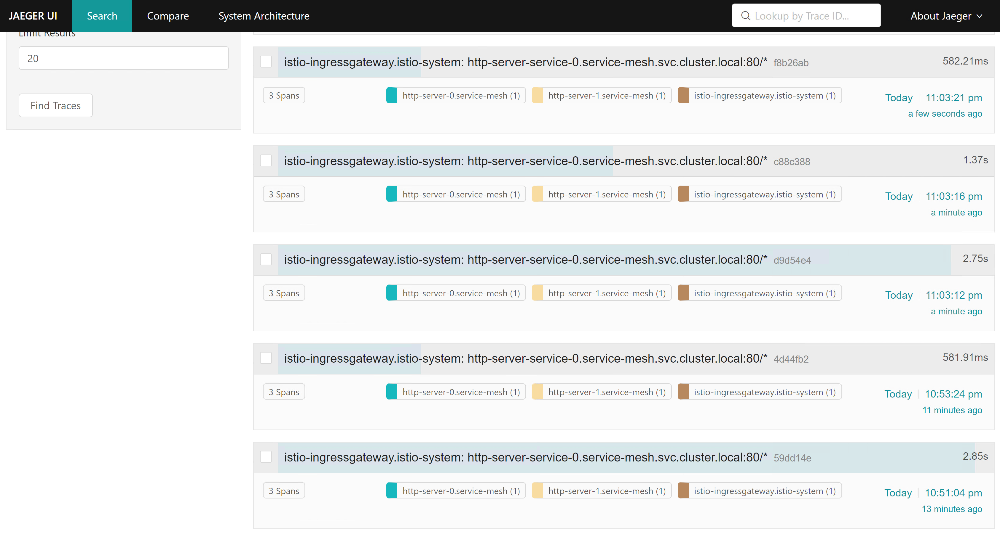

### 事前考量
1. 考虑到需要做open tracing的测试，需要在kubernetes中发布多个互相调用的服务
2. 由于服务之间只是一个简单调用的关系，所以不想开发多个模块，这里采用配置文件配置需要调用的服务地址

### http_server 改造
1. 支持从配置文件中读取下一级服务调用的地址

### istio安装
1. istio国内无法安装 查看脚本后 从指定地址下载 解压

### 编写deployment及configmap
1. 分别创建三个configmap、deployment、service

### 使用Istio Ingress Gateway 发布
1. 配置VirtualService及Gateway
```
chenxinpei@chenxinpei:~/homework/module12/yaml$ curl -H 'Host: http-server.io' 10.96.43.55 -v
*   Trying 10.96.43.55:80...
* TCP_NODELAY set
* Connected to 10.96.43.55 (10.0.1.59) port 80 (#0)
> GET / HTTP/1.1
> Host: http-server.io
> User-Agent: curl/7.68.0
> Accept: */*
>
* Mark bundle as not supporting multiuse
< HTTP/1.1 200 OK
< accept: */*
< user-agent: curl/7.68.0
< x-b3-sampled: 1
< x-b3-spanid: f455ba78cefce5e7
< x-b3-traceid: 72c99e8ee9f94005f455ba78cefce5e7
< x-envoy-attempt-count: 1
< x-envoy-internal: true
< x-forwarded-for: 10.0.0.79
< x-forwarded-proto: http
< x-request-id: ad1c6880-7e8d-933b-9c50-9e8c22e889d1
< date: Sun, 26 Dec 2021 13:27:21 GMT
< content-length: 0
< x-envoy-upstream-service-time: 2639
< server: istio-envoy
<
* Connection #0 to host 10.96.43.55 left intact
```


### 安全
1. 创建证书
2. 创建secret
3. 修改配置，使用https访问gateway
4. 按照原先的方式访问，明显不通
```
chenxinpei@chenxinpei:~/homework/module12/yaml$ curl -H 'Host: http-server.io' 10.96.43.55:443 -v
*   Trying 10.96.43.55:443...
* TCP_NODELAY set
* Connected to 10.96.43.55 (10.0.1.59) port 443 (#0)
> GET / HTTP/1.1
> Host: http-server.io
> User-Agent: curl/7.68.0
> Accept: */*
>
* Recv failure: Connection reset by peer
* Closing connection 0
curl: (56) Recv failure: Connection reset by peer
```
5. 改用https访问
```
Cchenxinpei@chenxinpei:~/homework/module12/yaml$ curl --resolve http-server.io:443:10.96.43.55 https://http-server.io -v -k
* Added http-server.io:443:10.96.43.55 to DNS cache
* Hostname http-server.io was found in DNS cache
*   Trying 10.96.43.55:443...
* TCP_NODELAY set
* Connected to http-server.io (10.0.1.59) port 443 (#0)
* ALPN, offering h2
* ALPN, offering http/1.1
* successfully set certificate verify locations:
*   CAfile: /etc/ssl/certs/ca-certificates.crt
  CApath: /etc/ssl/certs
* TLSv1.3 (OUT), TLS handshake, Client hello (1):
* TLSv1.3 (IN), TLS handshake, Server hello (2):
* TLSv1.3 (IN), TLS handshake, Encrypted Extensions (8):
* TLSv1.3 (IN), TLS handshake, Certificate (11):
* TLSv1.3 (IN), TLS handshake, CERT verify (15):
* TLSv1.3 (IN), TLS handshake, Finished (20):
* TLSv1.3 (OUT), TLS change cipher, Change cipher spec (1):
* TLSv1.3 (OUT), TLS handshake, Finished (20):
* SSL connection using TLSv1.3 / TLS_AES_256_GCM_SHA384
* ALPN, server accepted to use h2
* Server certificate:
*  subject: O=http-server Inc.; CN=*.http-server.io
*  start date: Dec 26 13:31:34 2021 GMT
*  expire date: Dec 26 13:31:34 2022 GMT
*  issuer: O=http-server Inc.; CN=*.http-server.io
*  SSL certificate verify result: self signed certificate (18), continuing anyway.
* Using HTTP2, server supports multi-use
* Connection state changed (HTTP/2 confirmed)
* Copying HTTP/2 data in stream buffer to connection buffer after upgrade: len=0
* Using Stream ID: 1 (easy handle 0x55d5605f0e10)
> GET / HTTP/2
> Host: http-server.io
> user-agent: curl/7.68.0
> accept: */*
>
* TLSv1.3 (IN), TLS handshake, Newsession Ticket (4):
* TLSv1.3 (IN), TLS handshake, Newsession Ticket (4):
* old SSL session ID is stale, removing
* Connection state changed (MAX_CONCURRENT_STREAMS == 2147483647)!
< HTTP/2 200
< accept: */*
< user-agent: curl/7.68.0
< x-b3-sampled: 1
< x-b3-spanid: 14da9569003d9008
< x-b3-traceid: 06d03578446f651614da9569003d9008
< x-envoy-attempt-count: 1
< x-envoy-internal: true
< x-forwarded-for: 10.0.0.79
< x-forwarded-proto: https
< x-request-id: ae6e886f-8ad3-9156-aef5-4db8014071a7
< date: Sun, 26 Dec 2021 13:42:19 GMT
< content-length: 0
< x-envoy-upstream-service-time: 1166
< server: istio-envoy
<
* Connection #0 to host http-server.io left intact
```
### 七层路由规则
```bash
1. 这道题目的含义我不是很明确，是要我们随便配个规则吗，这里我选择金丝雀
3. 打包一个新镜像，使用不同版本号推送到仓库
2. 新建一个deploy，并和http-server-0共享同一份配置，但是在header中添加一些额外信息
3. 新增一个istio-canary.yaml的配置，使其支持金丝雀
```

### open tracing
```bash
1. 安装jaeger
2. istioctl dashboard jaeger
3. 因为我这个k8s跑在虚拟机中，需要配置监听端口  istioctl dashboard jaeger --address 0.0.0.0
```

