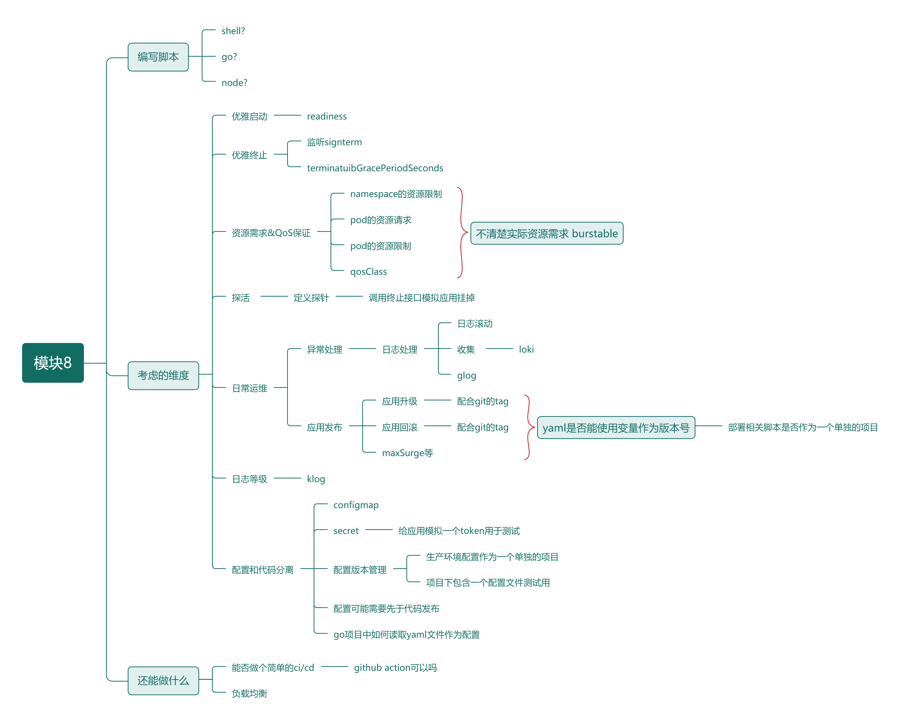

### 事前考量

####  http_server 项目改造

1. 读取外部配置文件，采取yaml格式
2. 监听外部配置文件变更
3. 配置文件中修改比如端口号的配置时，可能需要重启server，这里为了保证应用的访问，启动了一个新服务器，然后关闭旧的
4. 上条修改端口号本身没有什么意义，修改端口号本身就要修改service，容器应当是需要重新发布的，单纯的应用重启没有意义
5. glog模块进行日志分级 需要在启动时指定-v
4. 优雅终止
4. 优雅终止因为sh会忽略信号，这里修改dockerfile，引入tini
5. 将项目推送到github，并打上版本tag，用于项目本身的版本管理
5. 因为配置文件是通过configmap挂载为一个volume实现的，为了配置文件路径更灵活，应当支持通过命令行参数覆盖默认的配置文件路径

#### namespace创建

1. 创建一个namespace，做好resource quota限制

#### 日志处理

1. 日志打到stdout
1. 日志收集这里先不做 
1. 为了避免日志爆炸，去kubelet中进行containerLogMaxSize及containerLogMaxFiles的配置

####  配置文件分离
1. 创建一个用于保存配置文件的项目 并打上版本tag，主要用于配置文件的版本管理

2. 编写configmap的yaml

#### 应用发布失败的处理
1. 在应用容器打好tag，利用k8s自身的deployment的回滚功能

####  编写deployment
1. 当前项目为一个线上项目 所以有滚动发布的需求
2. 由于个人不是很擅长于评估项目的资源消耗，这里采用Burstable的QoS等级，同时在不同的worker上部署多个副本 保证服务的高可用
3. 同时定义一个优先级，保证线上业务的优先调度
3. 配置maxSurge及maxUnvailable保证应用升级时，失败及时停止滚动升级
4. 将configmap挂载为一个volumn
5. 这里发现一个问题 configmap在我的想法中是不一定挂载到应用所在目录的，所以这里对http_server做出改造，从环境变量中读取config文件路径
5. 定义readiness探针，保证应用启动成功后，容器才提供服务
### service
### ingress